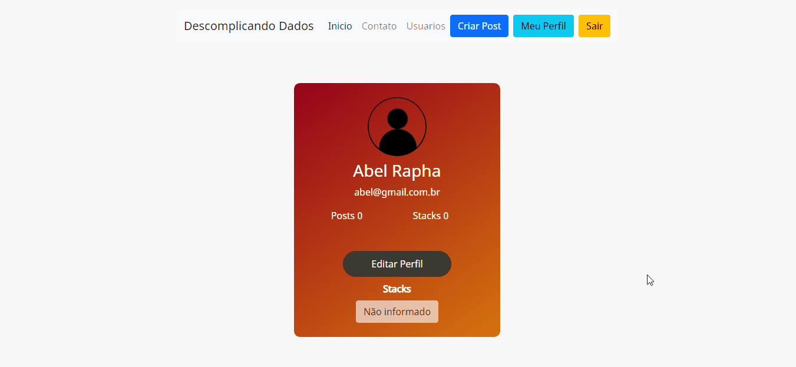

# Projeto Blog Descomplicando Dados
  
 
 ## __Contexto__
 Neste projeto realizei um tipo de blog simples utilizando algumas tecnologias.
 Link para acessar o projeto: [clique aqui](https://blogdescomplicandodados.herokuapp.com/)

 ## Stacks utilizadas no desenvolvimentos
 * Flask
 * Bootstrap
 * HTML5
 * CSS3

## Apresentação do projeto
